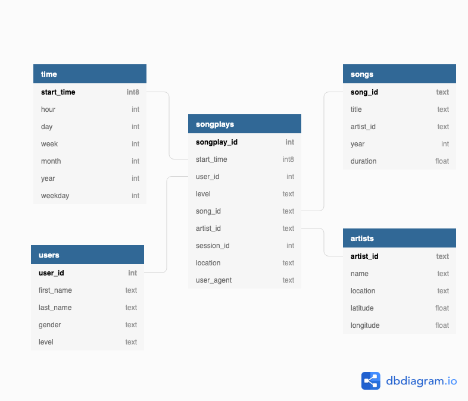

## Data Warehouse

This is a project from [Udacity Data Engineer Nanodegree](https://www.udacity.com/course/data-engineer-nanodegree--nd027). 

### Project Description

A music streaming startup, Sparkify, has grown their user base and song database and want to move their processes and data onto the cloud. Their data resides in S3, in a directory of JSON logs on user activity on the app, as well as a directory with JSON metadata on the songs in their app.

I will work as their data engineer to build an ETL pipeline that extracts their data from S3, stages them in Redshift, and transforms data into a set of dimensional tables for their analytics team to continue finding insights in what songs their users are listening to. In this case, the analytics team wants to understand `Three most popular song according to different months and levels of users in year 2018`.

### Datasets

I'll be working with two datasets that reside in S3. Here are the S3 links for each:

Song data: `s3://udacity-dend/song_data`
Log data: `s3://udacity-dend/log_data`
Log data json path: `s3://udacity-dend/log_json_path.json`

#### Song Dataset

The first dataset is a subset of real data from the Million Song Dataset. Each file is in JSON format and contains metadata about a song and the artist of that song. The files are partitioned by the first three letters of each song's track ID. For example, here are filepaths to two files in this dataset.

```
song_data/A/B/C/TRABCEI128F424C983.json
song_data/A/A/B/TRAABJL12903CDCF1A.json
```

And below is an example of what a single song file, TRAABJL12903CDCF1A.json, looks like.

```
{"num_songs": 1, "artist_id": "ARJIE2Y1187B994AB7", "artist_latitude": null, "artist_longitude": null, "artist_location": "", "artist_name": "Line Renaud", "song_id": "SOUPIRU12A6D4FA1E1", "title": "Der Kleine Dompfaff", "duration": 152.92036, "year": 0}
```

#### Log Dataset

The second dataset consists of log files in JSON format generated by this event simulator based on the songs in the dataset above. These simulate app activity logs from an imaginary music streaming app based on configuration settings.

The log files in the dataset you'll be working with are partitioned by year and month. For example, here are filepaths to two files in this dataset.

```
log_data/2018/11/2018-11-12-events.json
log_data/2018/11/2018-11-13-events.json
```

And below is an example of what the data in a log file, 2018-11-12-events.json, looks like.


A mapping for that event data is also provided.

### Roadmap

#### Schema

When staging data, nothing need to be modified, so I remain original schema. For analytics tables, I choose to create a star schema. It is shown below:



In this design, Dimension Tables focus on different parts of the data, such as users, songs, artists, time, which is straight forward. All Dimension Tables's primary keys are included in the Fact Table. A single JOIN is needed if you want to get the info of one dimension.

This design also has an advantage of reducing duplication. For example, there are a certain number of artists in the world. However, the number of songs from artists are ten times or more. If we have one big table of songs data along with artists' info (`name`, `location`, `lattitude`, `longitude`), without doubt the part of artists' info are redundant. Besides, it also has difficulty when updating artists' info. In this one big table of songs and artists data together, you have to find and update many places even for a single change.

The project  includes four main files:

- `create_table.py` is where I'll create my fact and dimension tables for the star schema in Redshift.
- `etl.py` is where I'll load data from S3 into staging tables on Redshift and then process that data into  analytics tables on Redshift.
- `sql_queries.py` is where I'll define you SQL statements, which will be imported into the two other files above.
- `dwh.cfg` is where I'll hold AWS credentials and S3 data paths. It includes a `Redshift` , `S3` and `IAM` role.

#### Steps

2. Write a SQL `DROP` and `CREATE` statement for each of these Star Schema tables in `sql_queries.py`
3. Write the logic in `create_tables.py` to connect to the database and create these tables
4. Run `create_tables.py` to reset the database
5. Launch a redshift cluster and create an IAM role that has read access to S3.
6. Add redshift database and IAM role info to `dwh.cfg`.
7. Test by running `create_tables.py` and checking the table schemas in the redshift database. `Query Editor` in the AWS Redshift console is my best friend.
8. Implement the logic in `etl.py` to load data from S3 to staging tables on Redshift.
9. Implement the logic in `etl.py` to load data from staging tables to analytics tables on Redshift.
10. Test by running `etl.py` after running `create_tables.py`

### How to use

1. Launch a redshift cluster and create an IAM role that has read access to S3.
2. Add redshift database and IAM role info to `dwh.cfg`.
3. Run `create_tables.py` to create tables needed.
4. Run `etl.py` to extract, transform and load data to analytical tables.
5. Run analytical queries to answer questions.

### Analytical Insights

To answer anlytics team's question `Three most popular song according to different months and levels of users in year 2018`, I write a query to fetch the data:

```sql
WITH sub AS (
SELECT t.month,
		s.title,
  		a.name,
        u.level,
        COUNT(*) AS ct
FROM songplays sp
JOIN songs s ON sp.song_id = s.song_id
JOIN users u ON sp.user_id = u.user_id
JOIN time t ON sp.start_time = t.start_time
JOIN artists a ON sp.artist_id = a.artist_id
GROUP BY t.month,
		s.title,
        u.level,
  		a.name,
  		t.year
HAVING t.year = 2018),

sub2 AS (SELECT month,
		title,
        level,
        name,
        RANK() OVER (PARTITION BY month, level ORDER BY ct DESC) AS rank
FROM sub)

SELECT month, 
        level,
        title,
        name,
        rank
FROM sub2
WHERE rank < 4
		
```

And the result is:

| month | level | title                                   | name                 |
| ----- | ----- | --------------------------------------- | -------------------- |
| 11    | paid  | Secrets                                 | Carleen Anderson     |
| 11    | paid  | You're The One                          | Dwight Yoakam        |
| 11    | paid  | Supermassive Black Hole (Album Version) | Muse                 |
| 11    | free  | Holiday                                 | Madonna              |
| 11    | free  | Overture                                | Blood_ Sweat & Tears |
| 11    | free  | Awake                                   | Godsmack             |

*(In this project, I am only provided with a subset of data, so all the events happened in Nov.)*

